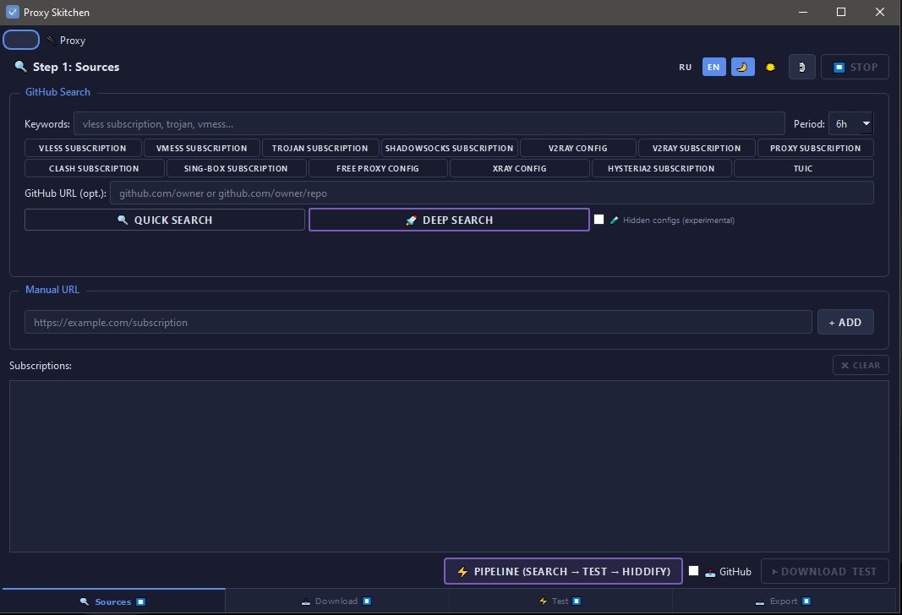

# proxy-skitchen

[](LICENSE)
[](https://www.python.org/)
[](https://wiki.qt.io/Qt_for_Python)

<table>
<tr>
<td>

**🇷🇺 Живущим в блокировках — держитесь. Свободный интернет всё ещё существует, просто его теперь ищут.**

**🌍 To those living behind censorship firewalls — stay strong. The open internet still exists; you just have to look a little harder for it.**

</td>
</tr>
</table>

> Find working proxy servers and subscriptions in minutes.  
> Scrape, test, and export — all in one desktop app.



---

## Stop hunting for proxies. Let the kitchen do the work.

**proxy-skitchen** automatically finds proxy configs on GitHub, tests them for real, and exports only the working ones.

Whether you need a handful of reliable servers for daily use or a large pool for load testing — you set the keywords, and the app does the rest.

### What you get

- **Live proxy list** — not dead links, not outdated dumps. Only servers that passed real TCP + HTTP testing.
- **Any format** — Clash, sing-box, Hiddify, V2RayN, or plain URI list. Import anywhere.
- **All major protocols** — VLESS, VMess, Trojan, Shadowsocks, Hysteria2, TUIC.
- **Country flags** — see at a glance where each server is located.
- **Cross-platform** — works on Linux, Windows, and macOS.

---

## How it works

```
🔍 Search GitHub  →  ⬇ Download configs  →  ✅ Test  →  📦 Export
```

1. **Search** — enter keywords like "vless subscription" or paste a GitHub repo URL.
2. **Download** — the app fetches all found configs in one click.
3. **Test** — quick TCP check, then deep HTTP validation via sing-box.
4. **Export** — save the working list in your preferred format.

---

## Why you'll like it

| | |
|---|---|
| **No hunting** | Scans GitHub repos automatically — finds what others hide in config files, READMEs, even random `.txt` dumps. |
| **No dead proxies** | Deep test makes real HTTP requests, not just ping. If it passes — it works. |
| **One-click export** | Clash, sing-box, Hiddify, V2RayN — pick your poison. |
| **Cross-platform** | Works on Linux, Windows (7/10/11), and macOS. Weak HW mode for low-RAM machines. |
| **Privacy first** | No accounts, no telemetry, no cloud. Everything runs locally. |

---

## Supported protocols

| Protocol | Parse | Test | Export |
|----------|-------|------|--------|
| VLESS | ✓ | ✓ | ✓ |
| VMess | ✓ | ✓ | ✓ |
| Trojan | ✓ | ✓ | ✓ |
| Shadowsocks | ✓ | ✓ | ✓ |
| Hysteria2 | ✓ | ✓ | ✓ |
| TUIC | ✓ | ✓ | ✓ |
| WireGuard | ✓ | – | – |

---

## Quick start

### Linux / macOS

```bash
git clone https://github.com/cyberanrhy/proxy-skitchen.git
cd proxy-skitchen
pip install -r requirements.txt
python3 -m proxy_skitchen
```

### Windows

```bash
git clone https://github.com/cyberanrhy/proxy-skitchen.git
cd proxy-skitchen
pip install -r requirements.txt
python -m proxy_skitchen
```

### Windows (EXE)

Download the latest release from [Releases](https://github.com/cyberanrhy/proxy-skitchen/releases) and run `proxy-skitchen-windows.exe`.

*Requires Python 3.10+ and curl. sing-box is optional (needed for deep test).*

---

## CLI mode

```bash
# Search and save
python3 -m proxy_skitchen search "vless subscription" --output sources.txt

# Full pipeline
python3 -m proxy_skitchen pipeline "vless subscription" --deep --output working.txt

# Quick test
python3 -m proxy_skitchen test 1.2.3.4 443

# Test all proxies in a file
python3 -m proxy_skitchen test-file proxies.txt --deep --output working.txt
```

---

## Building from source

### Linux

```bash
pip install pyinstaller
pyinstaller --onefile --windowed --name proxy-skitchen --hidden-import PySide6.QtSvg --hidden-import PySide6.QtNetwork --add-data "proxy_skitchen/icon.png:proxy_skitchen" --paths . run_proxy_skitchen.py
```

### Windows

```bash
pip install pyinstaller
pyinstaller --onefile --windowed --console --name proxy-skitchen --hidden-import PySide6.QtSvg --hidden-import PySide6.QtNetwork --add-data "proxy_skitchen/icon.png;proxy_skitchen" --paths . run_proxy_skitchen.py
```

The EXE will be in `dist/proxy-skitchen.exe`.

---

## License

MIT
